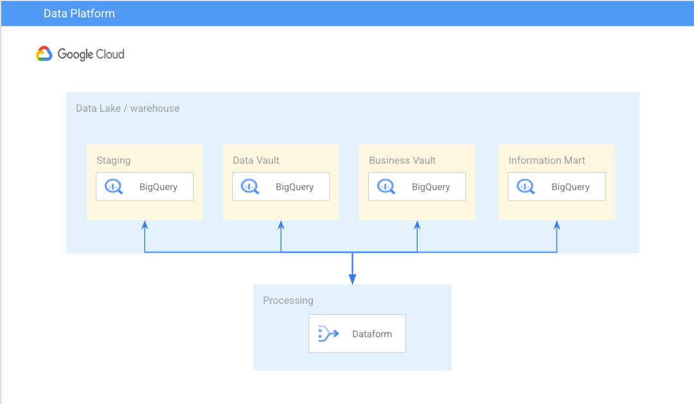

# DVForm
Dataform utility library that allow you to build a data vault model using a configuration based technique. 

## What is Data Vault ? 
Data vault is a relatively new design methodology for data warehouses. Data vaults store raw data as-is without applying business rules. Data transformation happens on-demand, and the results are available for viewing in a department-specific data mart. While a traditional data warehouse structure relies on extensive data pre-processing, the data vault model takes a more agile approach. This can help tackle difficult use cases, although it’s not always easy to implement.

###  Advantages of the Data Vault
* Raw Data Retention
* Simpler Transformations
* Decoupling of Rules and Data
* Department-Specific Data Transformations

### Disadvantages of a Data Vault
* Increased Resource Usage
* Expanded Data Storage
* Solution Complexity
* Slower Data Mart Results

### Data Vault Architecture Layers
* **Staging Layer** does not apply any changes to the data, it provides a temporary area to support the process of moving data from various sources into the Data Warehouse.
* **Raw Vault** stores persistently the data in a model built around the identification of the business keys in the data sources.
* **Business Vault** in which we deal with Soft Business Rules, Data Quality. There are many reasons to refactor it over time.
* **Information Mart** is needed because data in the Business Vault is still in the Hub, Link, Satellite shape and has to be shaped as expected by the final business user (e.g., star schema, feature store for Data Mining etc)

All these layers can be stored and maintained in separated BigQuery datasets as shown in below architecture diagram 

 

## CitiBike Example

Citibike entities are ingested into Stage Layer where we are keeping the data without applying any changes to it.   
 

###The Data Vault Model consists of 3 concepts: 

* **Hub Tables**: collects all the business keys present in a source entity.  
  For each Hub table we add 3 columns:
  * **Hash_Id** : A new String column to uniquely identify a record in the hub table, and it’s calculated based on the business keys. e.g   user_hash_id : md5(user_id)
  * **Source**: A new String column to capture the source data location / table.
  * **Load_Time**:  A new Timestamp column to represent the ingestion time into the table.
 
* **Link Tables**: represents, as N-to-N relationship, a relationship and uses the business keys to connect 2 Hubs. 
   For each Link table we add 3 columns
  * **Hash_Id** : A new String column to uniquely identify a record in the link table. E.g bike_trip_hash_id : md5(bike_hash_id, trip_hash_id)
  * **Source**: A new String column to capture the source data location / table.
  * **Load_Time**:  A new Timestamp column to represent the ingestion time into the table.
 
* **Satellite Tables** :  store all data that describes a row in a Hub or a Link. 
   For each satellite table we add 4 columns
  * **Hash_Id** : A new String column to refer to the hub hash id. e.g   user_hash_id
  * **Hash_diff** : A new String column to uniquely identify non-business key columns. e.g. users hash_diff: md5(user_type, gender, birth_year, customer_plan)
  * **Source**: A new String column to capture the source data location / table.
  * **Load_Time**:  A new Timestamp column to represent the ingestion time into the table.

So we need to change the citibike data model as below to store it at the **data vault Layer**

 